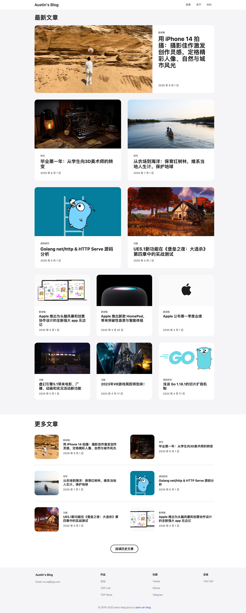
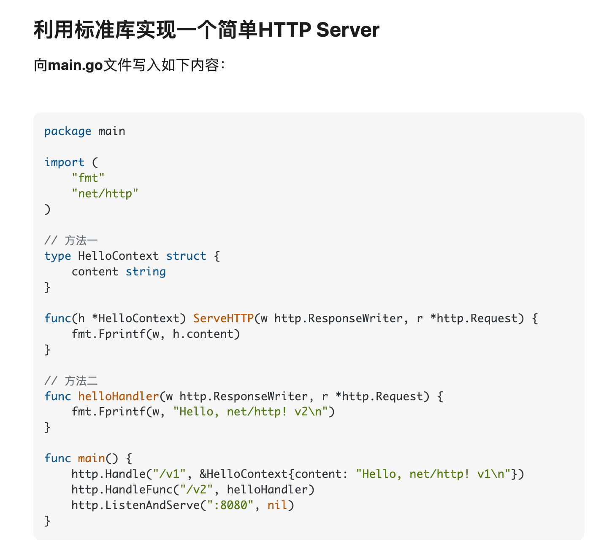

[中文版本说明](./README_CN.md)

## 👏🏻 Introduction

This is a minimalist, beautiful, responsive blogging program written in Astro.

## Preview

[https://yufengbiji.com](https://yufengbiji.com)  

[https://astro.yufengbiji.com](https://astro.yufengbiji.com)

### Home



### Dark mode


### Normal article


### Syntax highlighting



### Three display model of images


The three display modes of images are: `wide`, `big`, `inline`.
When you edit your markdown file, you can add `wide` or `big` or `inline` to the image alt, like this:

```markdown

```

<strong>The Separator is `|`, and the default mode is `big`.</strong>

## 🚀 Project Structure

In this Astro project, you'll see the following folders and files:

```
|-- README.md
|-- astro.config.mjs
|-- package.json
|-- public
|   |-- favicon.svg
|   `-- static
|-- src
|   |-- components
|   |   |-- BaseHead.astro // common <head> tags
|   |   |-- Footer.astro
|   |   |-- Header.astro
|   |   `-- Navigation.astro
|   |-- consts.js
|   |-- env.d.ts
|   |-- layouts
|   |   |-- BaseLayout.astro
|   |   |-- MarkdownPost.astro
|   |   |-- MoreTile.astro
|   |   `-- Tile.astro
|   |-- pages
|   |   |-- about.astro
|   |   |-- archive.astro
|   |   |-- index.astro
|   |   |-- posts 
|   |   |   |-- some markdown post.md // markdown post 
|   |   |-- rss.xml.js // RSS feed
|   |   `-- tags
|   |       `-- [tag].astro // dynamic route of all posts with a given tag
|   |-- styles
|   |   `-- global.css // global styles
|   `-- utils.js
```

Astro looks for `.astro` or `.md` files in the `src/pages/` directory. Each page is exposed as a route based on its file name.

There's nothing special about `src/components/`, but that's where we like to put any Astro/React/Vue/Svelte/Preact components.

Any static assets, like images, can be placed in the `public/` directory.

## 🧞 Commands

All commands are run from the root of the project, from a terminal:

| Command                | Action                                           |
| :--------------------- | :----------------------------------------------- |
| `npm install`          | Installs dependencies                            |
| `npm run dev`          | Starts local dev server at `localhost:3000`      |
| `npm run build`        | Build your production site to `./dist/`          |
| `npm run preview`      | Preview your build locally, before deploying     |
| `npm run astro ...`    | Run CLI commands like `astro add`, `astro check` |
| `npm run astro --help` | Get help using the Astro CLI                     |

## 👀 Want to learn more?

Feel free to check [our documentation](https://docs.astro.build) or jump into our [Discord server](https://astro.build/chat).
